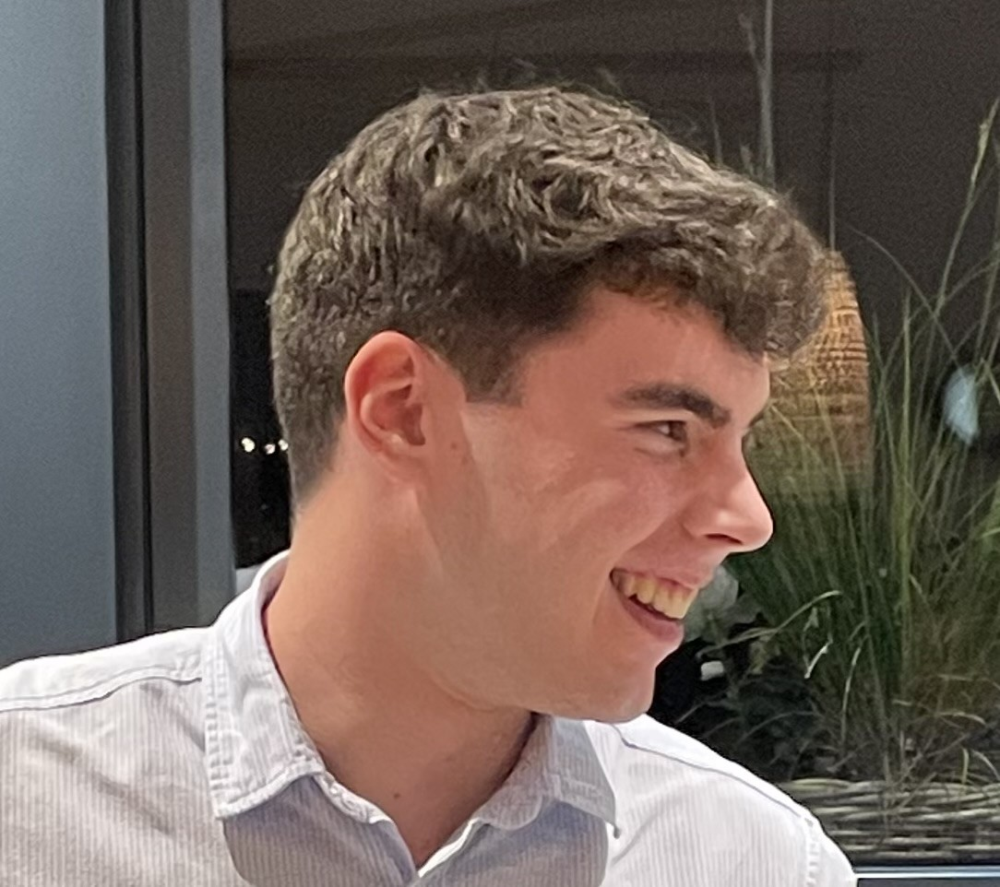
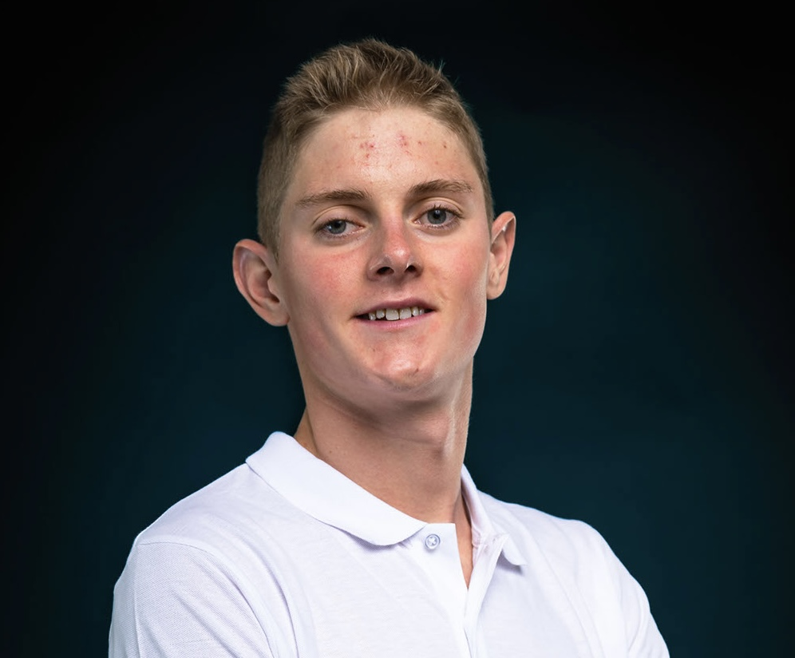

# Présentation de l'équipe 

Nous sommes trois étudiants à UniLaSalle Amiens en première année de cycle ingénieur, tout trois passionnés d’automobiles et de robotiques, ce projet de voiture radio télécommandée est pour nous un vrai défi à relever ! 

    

        
        
Jules Mailly

    

    

        
        
Enguerrand CUIF

    

    

        
        
Thomas LE PAPE

    

    <table>
        <thead>
            <tr>
                <th style="text-align: center">&nbsp;</th>
                <th style="text-align: center">Programmation</th>
                <th style="text-align: center">Bricolage</th>
                <th style="text-align: center">Modélisation</th>
                <th style="text-align: center">Conception</th>
            </tr>
        </thead>
        <tbody>
            <tr>
                <td style="text-align: center">Jules MAILLY</td>
                <td style="text-align: center">3</td>
                <td style="text-align: center">4</td>
                <td style="text-align: center">5</td>
                <td style="text-align: center">4</td>
            </tr>
            <tr>
                <td style="text-align: center">Enguerrand CUIF</td>
                <td style="text-align: center">3</td>
                <td style="text-align: center">5</td>
                <td style="text-align: center">4</td>
                <td style="text-align: center">4</td>
            </tr>
            <tr>
                <td style="text-align: center">Thomas LE PAPE</td>
                <td style="text-align: center">5</td>
                <td style="text-align: center">4</td>
                <td style="text-align: center">3</td>
                <td style="text-align: center">4</td>
            </tr>
        </tbody>
    </table>

**répartition des tâches**

Thomas Le Pape : réalisation du programme pour radio télécommandée la voiture 
Jules Mailly : réalisation de la modélisation 3D du châssis de la voiture 
Enguerrand Cuif : réalisation de la crémaillère de direction de la voiture 
